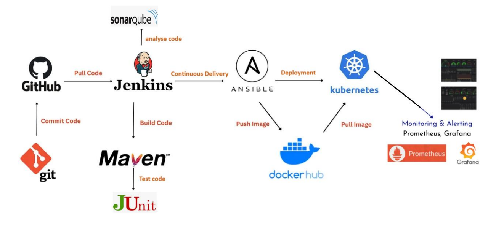

# Country Service

**Country Service** is a RESTful web service built with Spring Boot for managing country data. It demonstrates a full CI/CD pipeline with Jenkins, automated testing, code quality analysis, artifact management, and deployment.

## Technologies
- **Backend:** Java 21, Spring Boot 3.5.6, Spring Data JPA/REST, H2/MySQL, Lombok  
- **Testing:** JUnit 5, Mockito, MockMvc  
- **CI/CD:** Jenkins, Maven, SonarQube, Nexus, Ansible, Docker, Tomcat, ngrok  
- **Monitoring:** Prometheus, Grafana  
## Prerequisites
- Ubuntu/Debian (WSL2 for Windows)  
- Java 21, Maven 3.9+, Docker, Git  

## Setup

### Jenkins
```bash
sudo apt update && sudo apt install -y openjdk-21-jdk maven jenkins
sudo systemctl enable --now jenkins
```
Access Jenkins: http://localhost:8080

### Docker
```bash
sudo apt install -y docker.io
sudo systemctl enable --now docker
sudo usermod -aG docker $USER jenkins
newgrp docker
```
### SonarQube
```bash
docker run -d --name sonarqube -p 9000:9000 -e SONAR_ES_BOOTSTRAP_CHECKS_DISABLE=true sonarqube:latest
```
Access: http://localhost:9000
Default credentials: admin/admin
Generate token: My Account → Security → Generate Tokens
### Nexus
```bash
docker volume create nexus-data
docker run -d --name nexus -p 8081:8081 -v nexus-data:/nexus-data sonatype/nexus3:latest
```
Access: http://localhost:8081
Admin password: docker exec nexus cat /nexus-data/admin.password
Create Maven repository and Jenkins credentials
### Ansible
```bash
sudo apt install -y ansible openssh-server
ssh-keygen -t rsa -b 4096 -f ~/.ssh/ansible_id_rsa -N ""
cat ~/.ssh/ansible_id_rsa.pub >> ~/.ssh/authorized_keys
chmod 600 ~/.ssh/authorized_keys
```
Create deployment playbook at deploy/deploy-tomcat.yml to copy WAR to Tomcat container and restart it.
### Jenkins Pipeline
Install plugins: Git, Maven, SonarQube, Nexus, Ansible, JUnit, Docker Pipeline
Configure JDK, Maven, SonarQube, Nexus, Ansible credentials
Run Tomcat container:
```bash
docker run -d --name tomcat -p 8082:8080 tomcat:10.1-jdk21
```
Setup GitHub webhook via ngrok for automatic pipeline triggers
### GitHub Webhook via ngrok
```bash
wget https://bin.equinox.io/c/bNyj1mQVY4c/ngrok-v3-stable-linux-amd64.tgz
tar xvzf ngrok-v3-stable-linux-amd64.tgz
sudo mv ngrok /usr/local/bin/
ngrok config add-authtoken YOUR_AUTHTOKEN
ngrok http 8080
```
Copy forwarding URL and add webhook in GitHub repository settings
### Run Application Locally
```bash
git clone https://github.com/oumaymahammami/CountryService1.git
mvn clean install
mvn spring-boot:run
```
Access: http://localhost:8082

### CI/CD Pipeline Stages
#### Checkout: Pull latest code from GitHub
#### Compile: Compile Java source code
#### Test: Run unit and integration tests
#### Package: Build JAR/WAR artifact
#### SonarQube Analysis: Analyze code quality
#### Nexus Upload: Publish artifact to Nexus
#### Deploy to Tomcat: Deploy using Ansible
#### Trigger pipeline automatically on Git push:
```bash
git add .
git commit -m "Your commit message"
git push origin main
```
### Testing
```bash
mvn test
```
Unit & Integration tests using JUnit, Mockito, MockMvc
Reports: target/surefire-reports/ & Jenkins build results
### Monitoring & Quality
## Prometheus
Collects metrics from the application (CPU, memory, JVM metrics, and custom app metrics)
Run Prometheus container:
```bash
docker run -d --name prometheus -p 9090:9090 -v /path/to/prometheus.yml:/etc/prometheus/prometheus.yml prom/prometheus
```
Access: http://localhost:9090
## Grafana
Visualize metrics from Prometheus
Run Grafana container:
```bash
docker run -d --name grafana -p 3000:3000 grafana/grafana
```
Access: http://localhost:3000
Default credentials: admin/admin
Add Prometheus as a data source and create dashboards for monitoring
### Monitoring & Quality
SonarQube: http://localhost:9000
Nexus: http://localhost:8081
Jenkins: http://localhost:8080
Prometheus: http://localhost:9090
Grafana: http://localhost:3000

